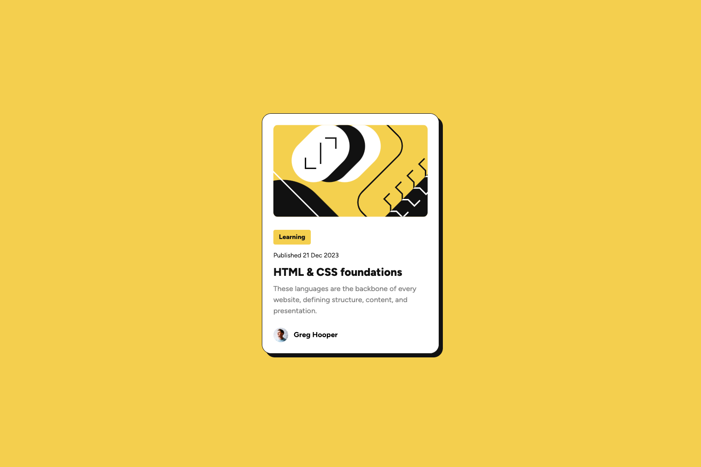

# Frontend Mentor - Blog preview card solution

This is a solution to the [Blog preview card challenge on Frontend Mentor](https://www.frontendmentor.io/challenges/blog-preview-card-ckPaj01IcS). Frontend Mentor challenges help you improve your coding skills by building realistic projects.

## Table of contents

- [Overview](#overview)
  - [The challenge](#the-challenge)
  - [Screenshot](#screenshot)
  - [Links](#links)
- [My process](#my-process)
  - [Built with](#built-with)
  - [What I learned](#what-i-learned)
- [Author](#author)

## Overview

### The challenge

Users should be able to:

- See hover and focus states for all interactive elements on the page

### Screenshot



### Links

- Solution URL: [Click Here](https://github.com/HerveWabo/blog-preview-card-figma)
- Live Site URL: [Click Here](https://hervewabo.github.io/blog-preview-card-figma/)

## My process

### Built with

- Semantic HTML5 markup
- CSS custom properties
- Flexbox
- Mobile-first workflow

### What I learned

It was my first time using align-self. Happy to have learned it today. It will be super handy in upcomming projects

```css
.tag {
  align-self: flex-start;
}
```

## Author

- Website - [Herve Wabo](https://www.your-site.com)
- Frontend Mentor - [@HerveWabo](https://www.frontendmentor.io/profile/HerveWabo)
- Twitter - [@iamhervewabo](https://www.twitter.com/iamhervewabo)
- Instagram - [@iamhervewabo](https://www.instagram.com/@iamhervewabo)
